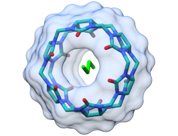
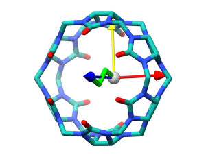
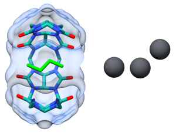
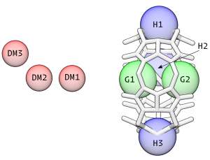
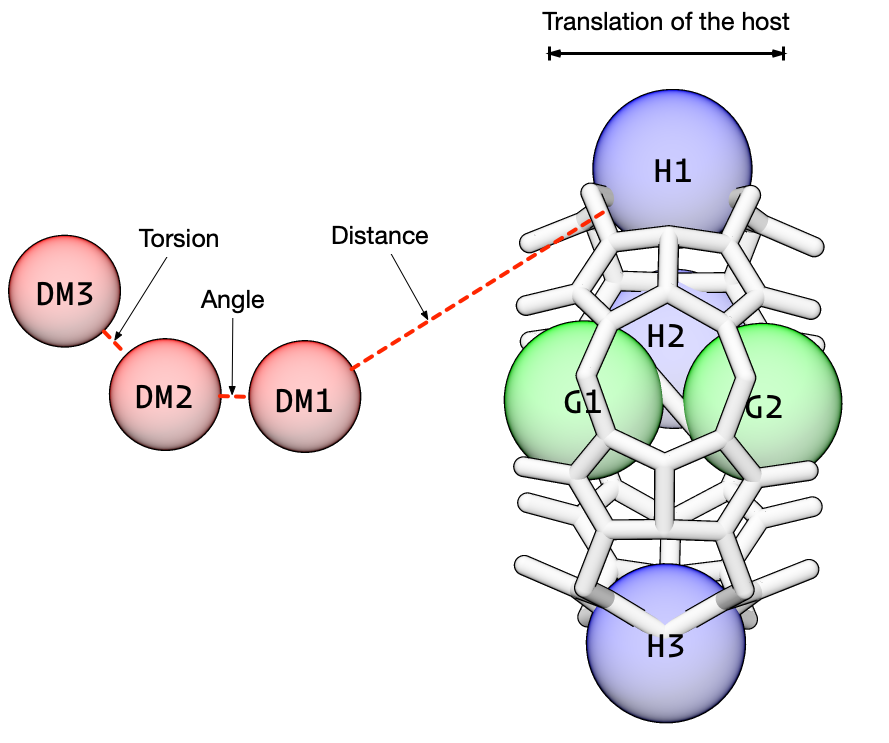
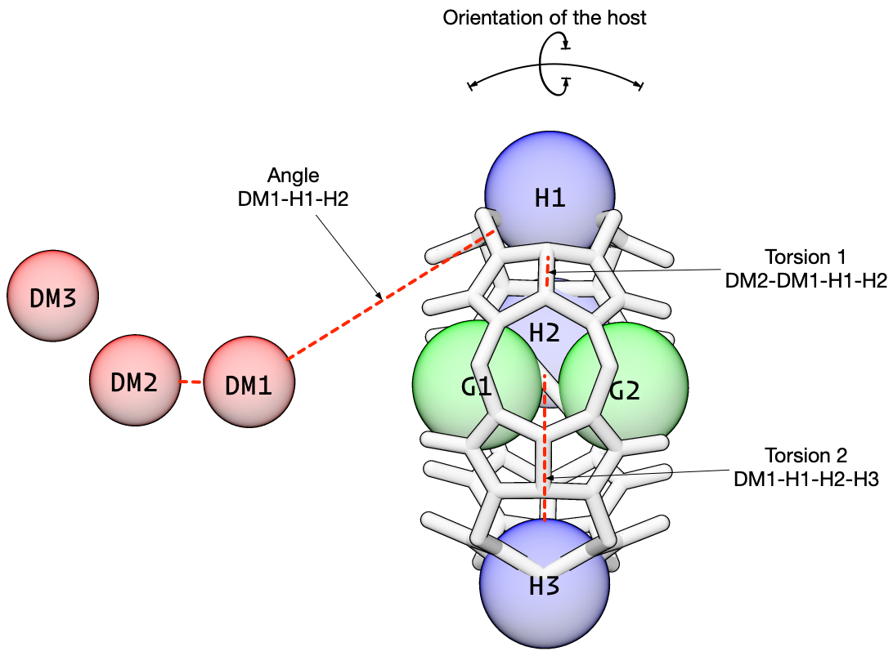
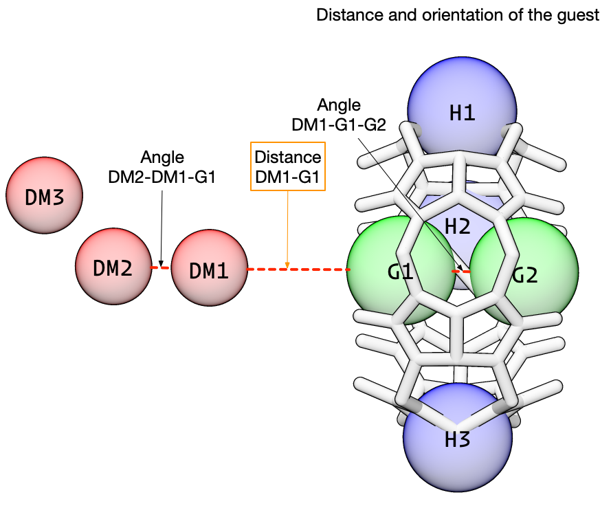

# pAPRika
pAPRika is a toolkit for setting up, running, and analyzing free energy molecular dynamics simulations.

# Badges
[](https://travis-ci.org/slochower/pAPRika)
[](https://codecov.io/gh/slochower/pAPRika)

# Installation

To install pAPRika, either clone this `git` repository or download [the latest release](https://github.com/slochower/pAPRika/releases).  Due to the potential for interactions with AMBER's own Miniconda installation, the recommended way to run pAPRika is through a dedicated `conda` environment. To create and use this environment, inside the `paprika` directory, run:

```
conda env create -f build/environment.yaml
conda activate paprika
```

# Example

In this example, we will setup and simulate butane (BUT) as a guest molecule for the host [cucurbit[6]uril](https://en.wikipedia.org/wiki/Cucurbituril) (CB6). CBs are rigid, symmetric, cyclic host molecules with oxygen atoms around the portal edge of the cavity. We will run the simulation in implicit solvent, using the [Generalized-Born](https://en.wikipedia.org/wiki/Implicit_solvation#Generalized_Born) model, for speed and simplicity, using AMBER. This tutorial assumes familiarity with basic MD procedures.

The `complex` folder referred to below are in the `tutorial` directory.

## Initial Setup

The very first step in the calculation is creating a coordinate file for the bound host-guest complex (we usually use PDB format for this part because it works well with `tleap`). This does not have to perfectly match the bound state by any means (we will later minimize and equilibrate), but this should be a reasonable illustration of the bound complex. This file can be created by hand (in a program like Chimera, VMD, or PyMOL) or by docking the guest into the host cavity (with MOE, AutoDock, DOCK, ...).

In this example, this file is called `cb6-but.pdb`, in the `complex/` directory, and this is what it looks like.



In addition to the coordinate file, we need separate `mol2` files for the host and guest molecule that contain the partial atomic charges. For cyclic hosts like CB6, you can specify either a single residue for the entire molecule (this is what we do here) or you can provide coordinates and charges for a single monomer and have `tleap` build the structure (this is a little more tricky).

The `mol2` files that we use here (`cb6.mol2` and `but.mol2`) were created by running `antechamber -fi pdb -fo mol2 -i <pdb> -o <mol2> -c bcc` (I added `pl 10` for the host, which reduces the number of paths that `antechamber` takes to traverse the host; see `antechamber` help for more information).

### Create AMBER coordinate (`.rst7` or `.inpcrd`) and parameter files (`.prmtop` or `.topo`) for the host-guest complex

In this example, we will use GAFF parameters for both the host and guest. For the host, `parmchk2` has identified two parameters that are missing from GAFF and added the most similar ones into the supplementary `cb6.frcmod` file.


```python
from paprika import tleap
```


```python
system = tleap.System()
system.output_path = "complex"
system.pbc_type = None
system.neutralize = False

system.template_lines = [
"source leaprc.gaff",
"loadamberparams cb6.frcmod",
"CB6 = loadmol2 cb6.mol2",
"BUT = loadmol2 but.mol2",
"model = loadpdb cb6-but.pdb",
"check model",
"savepdb model vac.pdb",
"saveamberparm model vac.prmtop vac.rst7"
]

system.build()
```

After running `tleap`, it is always a good idea to check `leap.log`. `pAPRika` does some automated checking of the ouptut, but sometimes things slip through. (By default, `tleap` will append to `leap.log`.)

## Prepare the complex for an APR calculation

Now we are ready to prepare the complex for the attach-pull-release calculation. This involves:

- Aligning the structure so the guest can be pulled along the $z$ axis, and
- Adding dummy atoms that are used to orient the host and guest.

To access the host-guest structure in Python, we use the ParmEd `Structure` class. So we start by loading the vacuum model that we just created. Then, we need to define two atoms on the guest that are placed along the $z$ axis. These should be heavy atoms on either end of the guest, the second atom leading the pulling.

These same atoms will be used later for the restraints, so I will name them `G1` and `G2`, using AMBER selection syntax.

### Align the pulling axis


```python
import parmed as pmd
```


```python
structure = pmd.load_file("complex/vac.prmtop",
                          "complex/vac.rst7",
                          structure=True)
```


```python
from paprika import align
```


```python
G1 = ":BUT@C"
G2 = ":BUT@C3"
```


```python
aligned_structure = align.zalign(structure, G1, G2)
aligned_structure.save("complex/aligned.prmtop", overwrite=True)
aligned_structure.save("complex/aligned.rst7", overwrite=True)
```

    /home/dslochower/data/applications/anaconda3/lib/python3.6/site-packages/paprika/align.py:31: RuntimeWarning: invalid value encountered in true_divide
      x     = np.cross(mask2_com, axis) / np.linalg.norm(np.cross(mask2_com, axis))


Here, the origin is shown as a grey sphere, with the $z$ axis drawn as a blue arrow. The coordinates used for this example were already aligned, so Python warns that the cross product is zero, but this won't be the case in general.



Next, we add the dummy atoms. The dummy atoms will be fixed in place during the simulation and are used to orient the host and guest in the lab frame. The dummy atoms are placed along the $z$ axis, behind the host. The dummy atoms are used in distance, angle, and torsion restraints and therefore, the exact positioning of these atoms affects the value of those restraints. For a typical host-guest system, like the one here, we generally place the first dummy atom 6 Angstroms behind the origin, the second dummy atom 9 Angstroms behind the origin, and the third dummy atom 11.2 Angstroms behind the origin and offset about 2.2 Angstroms along the $y$ axis. After we add restraints, the positioning of the dummy atoms should be more clear.

Note, these dummy atoms do not interact with the other atoms in the system, and therefore, there is no problem placing them near host atoms.

### Add dummy atoms


```python
from paprika import dummy
```


```python
structure = pmd.load_file("complex/aligned.prmtop",
                          "complex/aligned.rst7",
                          structure=True)
```


```python
structure = dummy.add_dummy(structure, residue_name="DM1", z=-6.0)
structure = dummy.add_dummy(structure, residue_name="DM2", z=-9.0)
structure = dummy.add_dummy(structure, residue_name="DM3", z=-11.2, y=2.2)
```


```python
structure.save("complex/aligned_with_dummy.prmtop", overwrite=True)
structure.save("complex/aligned_with_dummy.rst7", overwrite=True)
structure.save("complex/aligned_with_dummy.pdb", overwrite=True)
```



When we solvate the system in `tleap`, we will need `frcmod` files for the dummy atoms (otherwise `tleap` will use GAFF parameters and the dummy atoms will *not* be non-interacting). There is a convenient method in `paprika` to write a `frcmod` file that only contains a `MASS` section. For convenience, I am also going to write `mol2` files for each of the dummy atoms. This makes it easy to build up the system, piece-by-piece, if we have a separate `mol2` file for each component of the system: host, guest, dummy atoms.

In principle, an APR calculate can be completed without dummy atoms, by simply lengthening the distance between the host and guest, but the addition of dummy atoms permits an easier way to think about dissociating the guest from the host. (Also, in the absence of dummy atoms, it is challenging to pull the guest straight out of the cavity without adding additional restraints.)


```python
dummy.write_dummy_frcmod(filepath="complex/dummy.frcmod")
dummy.write_dummy_mol2(residue_name="DM1", filepath="complex/dm1.mol2")
dummy.write_dummy_mol2(residue_name="DM2", filepath="complex/dm2.mol2")
dummy.write_dummy_mol2(residue_name="DM3", filepath="complex/dm3.mol2")
```

Now all the pieces are in place to build the system for an APR calculation.

### Put it all together


```python
system = tleap.System()
system.output_path = "complex"
system.pbc_type = None
system.neutralize = False

system.template_lines = [
"source leaprc.gaff",
"loadamberparams cb6.frcmod",
"loadamberparams dummy.frcmod",
"CB6 = loadmol2 cb6.mol2",
"BUT = loadmol2 but.mol2",
"DM1 = loadmol2 dm1.mol2",
"DM2 = loadmol2 dm2.mol2",
"DM3 = loadmol2 dm3.mol2",
"model = loadpdb aligned_with_dummy.pdb",
"check model",
"savepdb model cb6-but-dum.pdb",
"saveamberparm model cb6-but-dum.prmtop cb6-but-dum.rst7"
]

system.build()
```

Now we have AMBER coordinates and parameters for the `cb6-but` system with dummy atoms in the appropriate place and with the proper "dummy" parametesr.



## Determine the number of windows

Before we add the restraints, it is helpful to set the λ fractions that control the strength of the force constants during attach and release, and to define the distances for the pulling phase.

The attach fractions go from 0 to 1 and we place more points at the bottom of the range to sample the curvature of ∂U/∂λ. Next, we generally apply a distance restraint until the guest is about 18 Å away from the host, in increments of 0.4 Å. This distance should be at least twice the Lennard-Jones cutoff in the system. These values have worked well for us, but this is one aspect that should be carefully checked for new systems.


```python
attach_string = "0.00 0.40 0.80 1.60 2.40 4.00 5.50 8.65 11.80 18.10 24.40 37.00 49.60 74.80 100.00"
attach_fractions = [float(i) / 100 for i in attach_string.split()]
```


```python
import numpy as np
initial_distance = 6.0
pull_distances = np.arange(0.0 + initial_distance, 18.0 + initial_distance, 1.0)
```

These values will be used to measure distance relative to the first dummy atom, hence the addition of `6.00`.


```python
release_fractions = []
```

Later, I will explain below why there are no release windows in this calculation.

```python
windows = [len(attach_fractions), len(pull_distances), len(release_fractions)]
print(f"There are {windows} windows in this attach-pull-release calculation.")
```

    There are [15, 18, 0] windows in this attach-pull-release calculation.


Alternatively, we could specify the number of windows for each phase and the force constants and targets will be linearly interpolated. Other ways of specifying these values are documented in the code.

## Add restraints using pAPRika

`pAPRika` supports four different types of restraints:


- Static restraints: these six restraints keep the host and in the proper orientation during the simulation (necessary),
- Guest restraints: these restraints pull the guest away from the host along the $z$ axis (necessary),
- Conformational restraints: these restraints alter the conformational sampling of the host molecule (optional), and
- Wall restraints: these restraints help define the bound state of the guest (optional).

More information on these restraints can be found in:

Henriksen, N.M., Fenley, A.T., and Gilson, M.K. (2015). Computational Calorimetry: High-Precision Calculation of Host-Guest Binding Thermodynamics. J. Chem. Theory Comput. 11, 4377–4394. [DOI](http://doi.org/10.1021/acs.jctc.5b00405)

In this example, I will show how to setup the static restraints and the guest restraints.

We have already added the dummy atoms and we have already defined the guest anchor atoms. Now we need to define the host anchor atoms (H1, H2, and H3) in the above diagram. The host anchors should be heavy atoms distributed around the cavity (and around the pulling axis). One caveat is that the host anchors should be rigid relative to each other, so conformational restraints do not shift the alignment of the pulling axis relative to the solvation box. For CB6, I have chosen carbons around the central ridge.


```python
H1 = ":CB6@C"
H2 = ":CB6@C31"
H3 = ":CB6@C18"
```

I'll also make a shorthand for the dummy atoms.


```python
D1 = ":DM1"
D2 = ":DM2"
D3 = ":DM3"
```

### Static restraints

These harmonic restraints are constant throughout the entire simulation. These restraints are used to control the distances and angles between the host and guest relative to the dummy atom. We have created a special class for these restrains, `static_DAT_restraint`, that uses the initial value as the restraint target (this is why the starting structure should be a reasonable facsimile of the bound state).

Note that these restraints are not "attached" and they don't need to be "released" -- their force constants do not change in magnitude.

The first three static restraints affect the translational distance, angle, and torsion angle between the host and the dummy atoms. These control the position of the host, via the first anchor atom, from moving relative to the dummy atoms.

There is no *correct* value for the force constants. From experience, we know that a distance force constant of 5.0 kcal/mol/Angstrom$^2$ won't nail down the host and yet it also won't wander away. Likewise, we have had good results using 100.0 kcal/mol/radian$^2$ for the angle force constant.




```python
from paprika import restraints
static_restraints = []
```


```python
structure = pmd.load_file("complex/cb6-but-dum.prmtop",
                          "complex/cb6-but-dum.rst7",
                          structure = True
                          )
```


```python
r = restraints.static_DAT_restraint(restraint_mask_list = [D1, H1],
                                    num_window_list = windows,
                                    ref_structure = structure,
                                    force_constant = 5.0,
                                    amber_index=True)

static_restraints.append(r)
```


```python
r = restraints.static_DAT_restraint(restraint_mask_list = [D2, D1, H1],
                                    num_window_list = windows,
                                    ref_structure = structure,
                                    force_constant = 100.0,
                                    amber_index=True)

static_restraints.append(r)
```


```python
r = restraints.static_DAT_restraint(restraint_mask_list = [D3, D2, D1, H1],
                                    num_window_list = windows,
                                    ref_structure = structure,
                                    force_constant = 100.0,
                                    amber_index=True)

static_restraints.append(r)
```

The next three restraints control the orientation of the host relative to the dummy atoms. These angle and torsion restraints prevent the host from rotating relative to the dummy atoms.




```python
r = restraints.static_DAT_restraint(restraint_mask_list = [D1, H1, H2],
                                    num_window_list = windows,
                                    ref_structure = structure,
                                    force_constant = 100.0,
                                    amber_index=True)

static_restraints.append(r)
```


```python
r = restraints.static_DAT_restraint(restraint_mask_list = [D2, D1, H1, H2],
                                    num_window_list = windows,
                                    ref_structure = structure,
                                    force_constant = 100.0,
                                    amber_index=True)

static_restraints.append(r)
```


```python
r = restraints.static_DAT_restraint(restraint_mask_list = [D1, H1, H2, H3],
                                    num_window_list = windows,
                                    ref_structure = structure,
                                    force_constant = 100.0,
                                    amber_index=True)

static_restraints.append(r)
```

Next, we add restraints on the guest. These restraints control the position of the guest and are the key to the attach-pull-release method. During the attach phase, the *force constants* for these restraints is increased from zero. During the pull phase, the *target* for the distance restraint is increased (in the orange box, below), translating the guest away from the host cavity. And during the release phase, the *force constants* are reduced from their "full" value back down to zero.



We use the class `DAT_restraint` to create these three restraints. We will use the same anchor atoms as before, with the same distance and angle force constants. Note that unlike `static_DAT_restraint`, we will first create the restraint, *then* set the attributes, *then* initialize the restraint which does some checks to make sure everything is copacetic.

There are two additional convenience options here:

- `auto_apr = True` sets the force constant during pull to be the final force constant after attach and sets the initial restraint target during pull to be the final attach target.

- `continuous_apr = True` sets the last window of attach to be the same as the first window as pull (and likewise for release)

Also note, due to a quirk with AMBER, we specifcy angle and torsion targets in degrees but the force constant using radians!


```python
guest_restraints = []
```


```python
r = restraints.DAT_restraint()
r.mask1 = D1
r.mask2 = G1
r.topology = structure
r.auto_apr = True
r.continuous_apr = True
r.amber_index = True

r.attach["target"] = 6.0                            # Angstroms
r.attach["fraction_list"] = attach_fractions
r.attach["fc_final"] = 5.0                          # kcal/mol/Angstroms**2

r.pull["target_final"] = 24.0                       # Angstroms
r.pull["num_windows"] = windows[1]

r.initialize()
guest_restraints.append(r)
```


```python
r = restraints.DAT_restraint()
r.mask1 = D2
r.mask2 = D1
r.mask3 = G1
r.topology = structure
r.auto_apr = True
r.continuous_apr = True
r.amber_index = True

r.attach["target"] = 180.0                          # Degrees
r.attach["fraction_list"] = attach_fractions
r.attach["fc_final"] = 100.0                        # kcal/mol/radian**2

r.pull["target_final"] = 180.0                      # Degrees
r.pull["num_windows"] = windows[1]

r.initialize()
guest_restraints.append(r)
```


```python
r = restraints.DAT_restraint()
r.mask1 = D1
r.mask2 = G1
r.mask3 = G2
r.topology = structure
r.auto_apr = True
r.continuous_apr = True
r.amber_index = True

r.attach["target"] = 180.0                          # Degrees
r.attach["fraction_list"] = attach_fractions
r.attach["fc_final"] = 100.0                        # kcal/mol/radian**2

r.pull["target_final"] = 180.0                      # Degrees
r.pull["num_windows"] = windows[1]

r.initialize()
guest_restraints.append(r)
```

## Create the directory structure

We use the guest restraints to create a list of windows with the appropriate names and then we create the directories.


```python
import os

window_list = restraints.create_window_list(guest_restraints)
for window in window_list:
    os.makedirs(f"windows/{window}")
```

## Next, we ask pAPRika to write the restraint information in each window

In each window, we create a file named `disang.rest` to hold all of the restraint information that is required to run the simulation with AMBER. We feed the list of restraints to pAPRika, one by one, and it returns the appropriate line.

The functional form of the restraints is specified in section 25.1 of the AMBER18 manual. Specifically, these restraints have a square bottom with parabolic sides out to a specific distance and then linear sides beyond that. The square bottom can be eliminated by setting `r2=r3` and the linear extension can be eliminated by setting the the `r4 = 999` and `r1 = 0`, creating a harmonic restraint


```python
host_guest_restraints = static_restraints + guest_restraints
for window in window_list:
    with open(f"windows/{window}/disang.rest", "a") as file:
        for restraint in host_guest_restraints:
            string = restraints.amber_restraint_line(restraint, window)
            if string is not None:
                file.write(string)
```

It is a good idea to open up the `disang.rest` files and see that the force constants and targets make sense (and there are no `NaN` values). Do the force constants for the guest restraints start at zero? Do the targets for the pull slowly increase?

## Create the coordinates for each window

### Translation of the guest (before solvation)

For the attach windows, we will use the initial, bound coordinates for the host-guest complex. Only the force constants change during this phase, so a single set of coordinates is sufficient. For the pull windows, we will translate the guest to the target value of the restraint before solvation, and for the release windows, we will use the coordinates from the final pull window.


```python
import shutil

for window in window_list:
    if window[0] == "a":
        shutil.copy("complex/cb6-but-dum.prmtop", f"windows/{window}/cb6-but-dum.prmtop")
        shutil.copy("complex/cb6-but-dum.rst7", f"windows/{window}/cb6-but-dum.rst7")
    elif window[0] == "p":
        structure = pmd.load_file("complex/cb6-but-dum.prmtop", "complex/cb6-but-dum.rst7",
                          structure = True)
        target_difference = guest_restraints[0].phase['pull']['targets'][int(window[1:])] - guest_restraints[0].pull['target_initial']
        print(f"In window {window} we will translate the guest {target_difference:0.1f} Angstroms.")
        for atom in structure.atoms:
            if atom.residue.name == "BUT":
                atom.xz += target_difference
        structure.save(f"windows/{window}/cb6-but-dum.prmtop")
        structure.save(f"windows/{window}/cb6-but-dum.rst7")
```

    In window p000 we will translate the guest 0.0 Angstroms.
    In window p001 we will translate the guest 1.1 Angstroms.
    In window p002 we will translate the guest 2.1 Angstroms.
    In window p003 we will translate the guest 3.2 Angstroms.
    In window p004 we will translate the guest 4.2 Angstroms.
    In window p005 we will translate the guest 5.3 Angstroms.
    In window p006 we will translate the guest 6.4 Angstroms.
    In window p007 we will translate the guest 7.4 Angstroms.
    In window p008 we will translate the guest 8.5 Angstroms.
    In window p009 we will translate the guest 9.5 Angstroms.
    In window p010 we will translate the guest 10.6 Angstroms.
    In window p011 we will translate the guest 11.6 Angstroms.
    In window p012 we will translate the guest 12.7 Angstroms.
    In window p013 we will translate the guest 13.8 Angstroms.
    In window p014 we will translate the guest 14.8 Angstroms.
    In window p015 we will translate the guest 15.9 Angstroms.
    In window p016 we will translate the guest 16.9 Angstroms.
    In window p017 we will translate the guest 18.0 Angstroms.


Before running a simulation, open each window and check that the position of the host and dummy atoms are fixed and that the position of the guest is bound during the attach windows, moves progressively further during pull, and is away from the host during the release windows.

## Simulate

Since we are going to run an implicit solvent simulation, we have everything ready to go. `paprika` has an `amber` module that can help setting default parameters for the simulation. There are some high level options that we set directly, like `simulation.path`, and then we call the function `config_gb_min()` to setup reasonable default simulation parameters for a minimization in the Generalized-Born ensemble. After that, we directly modify the simulation `cntrl` section to apply the positional restraints on the dummy atoms.

For this part, you need to have the AMBER executables in your path.


```python
from paprika import amber
```

Run a quick minimization in every window. Note that we need to specify `simulation.cntrl["ntr"] = 1` to enable the positional restraints on the dummy atoms.

I'm using the `logging` module to keep track of time.


```python
import logging
from importlib import reload
reload(logging)

logger = logging.getLogger()
logging.basicConfig(
    format='%(asctime)s %(message)s',
    datefmt='%Y-%m-%d %I:%M:%S %p',
    level=logging.INFO
)
```


```python
for window in window_list:
    simulation = amber.Simulation()
    simulation.executable = "sander"

    simulation.path = f"windows/{window}/"
    simulation.prefix = "minimize"

    simulation.inpcrd = "cb6-but-dum.rst7"
    simulation.ref = "cb6-but-dum.rst7"
    simulation.topology = "cb6-but-dum.prmtop"
    simulation.restraint_file = "disang.rest"

    simulation.config_gb_min()
    simulation.cntrl["ntr"] = 1
    simulation.cntrl["restraint_wt"] = 50.0
    simulation.cntrl["restraintmask"] = "'@DUM'"

    logging.info(f"Running minimization in window {window}...")
    simulation.run()
```

    2018-09-17 10:47:15 AM Running Minimization at windows/a000/
    2018-09-17 10:47:26 AM Minimization completed...
    2018-09-17 10:47:26 AM Running Minimization at windows/a001/
    2018-09-17 10:47:37 AM Minimization completed...
    2018-09-17 10:47:37 AM Running Minimization at windows/a002/
    2018-09-17 10:47:48 AM Minimization completed...
    2018-09-17 10:47:48 AM Running Minimization at windows/a003/
    2018-09-17 10:48:00 AM Minimization completed...
    2018-09-17 10:48:00 AM Running Minimization at windows/a004/
    2018-09-17 10:48:10 AM Minimization completed...
    2018-09-17 10:48:10 AM Running Minimization at windows/a005/
    2018-09-17 10:48:21 AM Minimization completed...
    2018-09-17 10:48:21 AM Running Minimization at windows/a006/
    2018-09-17 10:48:33 AM Minimization completed...
    2018-09-17 10:48:33 AM Running Minimization at windows/a007/
    2018-09-17 10:48:43 AM Minimization completed...
    2018-09-17 10:48:43 AM Running Minimization at windows/a008/
    2018-09-17 10:48:54 AM Minimization completed...
    2018-09-17 10:48:54 AM Running Minimization at windows/a009/
    2018-09-17 10:49:05 AM Minimization completed...
    2018-09-17 10:49:05 AM Running Minimization at windows/a010/
    2018-09-17 10:49:15 AM Minimization completed...
    2018-09-17 10:49:15 AM Running Minimization at windows/a011/
    2018-09-17 10:49:26 AM Minimization completed...
    2018-09-17 10:49:26 AM Running Minimization at windows/a012/
    2018-09-17 10:49:37 AM Minimization completed...
    2018-09-17 10:49:37 AM Running Minimization at windows/a013/
    2018-09-17 10:49:47 AM Minimization completed...
    2018-09-17 10:49:47 AM Running Minimization at windows/p000/
    2018-09-17 10:49:58 AM Minimization completed...
    2018-09-17 10:49:58 AM Running Minimization at windows/p001/
    2018-09-17 10:50:09 AM Minimization completed...
    2018-09-17 10:50:09 AM Running Minimization at windows/p002/
    2018-09-17 10:50:19 AM Minimization completed...
    2018-09-17 10:50:19 AM Running Minimization at windows/p003/
    2018-09-17 10:50:30 AM Minimization completed...
    2018-09-17 10:50:30 AM Running Minimization at windows/p004/
    2018-09-17 10:50:40 AM Minimization completed...
    2018-09-17 10:50:40 AM Running Minimization at windows/p005/
    2018-09-17 10:50:51 AM Minimization completed...
    2018-09-17 10:50:51 AM Running Minimization at windows/p006/
    2018-09-17 10:51:01 AM Minimization completed...
    2018-09-17 10:51:01 AM Running Minimization at windows/p007/
    2018-09-17 10:51:12 AM Minimization completed...
    2018-09-17 10:51:12 AM Running Minimization at windows/p008/
    2018-09-17 10:51:22 AM Minimization completed...
    2018-09-17 10:51:22 AM Running Minimization at windows/p009/
    2018-09-17 10:51:32 AM Minimization completed...
    2018-09-17 10:51:32 AM Running Minimization at windows/p010/
    2018-09-17 10:51:43 AM Minimization completed...
    2018-09-17 10:51:43 AM Running Minimization at windows/p011/
    2018-09-17 10:51:53 AM Minimization completed...
    2018-09-17 10:51:53 AM Running Minimization at windows/p012/
    2018-09-17 10:52:04 AM Minimization completed...
    2018-09-17 10:52:04 AM Running Minimization at windows/p013/
    2018-09-17 10:52:14 AM Minimization completed...
    2018-09-17 10:52:14 AM Running Minimization at windows/p014/
    2018-09-17 10:52:24 AM Minimization completed...
    2018-09-17 10:52:24 AM Running Minimization at windows/p015/
    2018-09-17 10:52:35 AM Minimization completed...
    2018-09-17 10:52:35 AM Running Minimization at windows/p016/
    2018-09-17 10:52:45 AM Minimization completed...
    2018-09-17 10:52:45 AM Running Minimization at windows/p017/


For simplicity, I am going to skip equilibration and go straight to production!


```python
for window in window_list:
    simulation = amber.Simulation()
    simulation.executable = "pmemd.cuda"

    simulation.path = f"windows/{window}/"
    simulation.prefix = "production"

    simulation.inpcrd = "minimize.rst7"
    simulation.ref = "cb6-but-dum.rst7"
    simulation.topology = "cb6-but-dum.prmtop"
    simulation.restraint_file = "disang.rest"

    simulation.config_gb_md()
    simulation.cntrl["ntr"] = 1
    simulation.cntrl["restraint_wt"] = 50.0
    simulation.cntrl["restraintmask"] = "'@DUM'"

    logging.info(f"Running production in window {window}...")
    simulation.run()
```

    2018-09-17 10:55:22 AM Running MD at windows/a000/
    2018-09-17 10:55:24 AM MD completed ...
    2018-09-17 10:55:24 AM Running MD at windows/a001/
    2018-09-17 10:55:26 AM MD completed ...
    2018-09-17 10:55:26 AM Running MD at windows/a002/
    2018-09-17 10:55:27 AM MD completed ...
    2018-09-17 10:55:27 AM Running MD at windows/a003/
    2018-09-17 10:55:29 AM MD completed ...
    2018-09-17 10:55:29 AM Running MD at windows/a004/
    2018-09-17 10:55:30 AM MD completed ...
    2018-09-17 10:55:30 AM Running MD at windows/a005/
    2018-09-17 10:55:32 AM MD completed ...
    2018-09-17 10:55:32 AM Running MD at windows/a006/
    2018-09-17 10:55:33 AM MD completed ...
    2018-09-17 10:55:33 AM Running MD at windows/a007/
    2018-09-17 10:55:35 AM MD completed ...
    2018-09-17 10:55:35 AM Running MD at windows/a008/
    2018-09-17 10:55:36 AM MD completed ...
    2018-09-17 10:55:36 AM Running MD at windows/a009/
    2018-09-17 10:55:38 AM MD completed ...
    2018-09-17 10:55:38 AM Running MD at windows/a010/
    2018-09-17 10:55:39 AM MD completed ...
    2018-09-17 10:55:39 AM Running MD at windows/a011/
    2018-09-17 10:55:41 AM MD completed ...
    2018-09-17 10:55:41 AM Running MD at windows/a012/
    2018-09-17 10:55:42 AM MD completed ...
    2018-09-17 10:55:42 AM Running MD at windows/a013/
    2018-09-17 10:55:44 AM MD completed ...
    2018-09-17 10:55:44 AM Running MD at windows/p000/
    2018-09-17 10:55:45 AM MD completed ...
    2018-09-17 10:55:45 AM Running MD at windows/p001/
    2018-09-17 10:55:47 AM MD completed ...
    2018-09-17 10:55:47 AM Running MD at windows/p002/
    2018-09-17 10:55:48 AM MD completed ...
    2018-09-17 10:55:48 AM Running MD at windows/p003/
    2018-09-17 10:55:50 AM MD completed ...
    2018-09-17 10:55:50 AM Running MD at windows/p004/
    2018-09-17 10:55:51 AM MD completed ...
    2018-09-17 10:55:51 AM Running MD at windows/p005/
    2018-09-17 10:55:53 AM MD completed ...
    2018-09-17 10:55:53 AM Running MD at windows/p006/
    2018-09-17 10:55:54 AM MD completed ...
    2018-09-17 10:55:54 AM Running MD at windows/p007/
    2018-09-17 10:55:56 AM MD completed ...
    2018-09-17 10:55:56 AM Running MD at windows/p008/
    2018-09-17 10:55:57 AM MD completed ...
    2018-09-17 10:55:57 AM Running MD at windows/p009/
    2018-09-17 10:55:59 AM MD completed ...
    2018-09-17 10:55:59 AM Running MD at windows/p010/
    2018-09-17 10:56:00 AM MD completed ...
    2018-09-17 10:56:00 AM Running MD at windows/p011/
    2018-09-17 10:56:02 AM MD completed ...
    2018-09-17 10:56:02 AM Running MD at windows/p012/
    2018-09-17 10:56:03 AM MD completed ...
    2018-09-17 10:56:03 AM Running MD at windows/p013/
    2018-09-17 10:56:05 AM MD completed ...
    2018-09-17 10:56:05 AM Running MD at windows/p014/
    2018-09-17 10:56:06 AM MD completed ...
    2018-09-17 10:56:06 AM Running MD at windows/p015/
    2018-09-17 10:56:08 AM MD completed ...
    2018-09-17 10:56:08 AM Running MD at windows/p016/
    2018-09-17 10:56:09 AM MD completed ...
    2018-09-17 10:56:09 AM Running MD at windows/p017/
    2018-09-17 10:56:11 AM MD completed ...


## Analysis

Once the simulation is completed, we can using the `analysis` module to determine the binding free energy. We supply the location of the parameter information, a string or list for the file names (wildcards supported), the location of the windows, and the restraints on the guest.

In this example, we use the method `ti-block` which determines the free energy using **t**hermodynamic **i**integration and then estimates the standard error of the mean at each data point using blocking analysis. Bootstrapping it used to determine the uncertainty of the  full thermodynamic integral for each phase.

After running `compute_free_energy()`, a dictionary called `results` will be populated, that contains the free energy and SEM for each phase of the simulation.


```python
from paprika import analysis
```


```python
free_energy = analysis.fe_calc()
free_energy.prmtop = "cb6-but-dum.prmtop"
free_energy.trajectory = 'production*.nc'
free_energy.path = "windows"
free_energy.restraint_list = guest_restraints
free_energy.collect_data()
free_energy.methods = ['ti-block']
free_energy.ti_matrix = "full"
free_energy.bootcycles = 1000
free_energy.compute_free_energy()
```

But what about release? The guest's rotational and translational degrees of freedom are still restrained releative to the frame of reference of the host. The work to release these restraints is the difference between the chemical potential of this state, and the chemical potentials of the separate host and guest at standard concentration. This can be calculated analytically without doing additional simulation (see [equation 8](https://pubs.acs.org/doi/10.1021/acs.jctc.5b00405)), using the function `compute_ref_state_work`.

```python

free_energy.compute_ref_state_work([
        guest_restraints[0], guest_restraints[1], None, None,
        guest_restraints[2], None
])

binding_affinity = -1 * (
free_energy.results["attach"]["ti-block"]["fe"] + \
free_energy.results["pull"]["ti-block"]["fe"] + \
free_energy.results["ref_state_work"]

)

sem = np.sqrt(
free_energy.results["attach"]["ti-block"]["sem"]**2 + \
free_energy.results["pull"]["ti-block"]["sem"]**2
)
```


```python
print(f"The binding affinity for butane and cucurbit[6]uril = {binding_affinity:0.2f} +/- {sem:0.2f} kcal/mol")
```

    The binding affinity for butane and cucurbit[6]uril = -9.00 +/- 5.53 kcal/mol


There is a large uncertainty associated with this calculation because we only simulated for a very short amount of time in each window and we used a large amount of spacing between each window in the pull phase, but the uncertainty will go down with more time.
